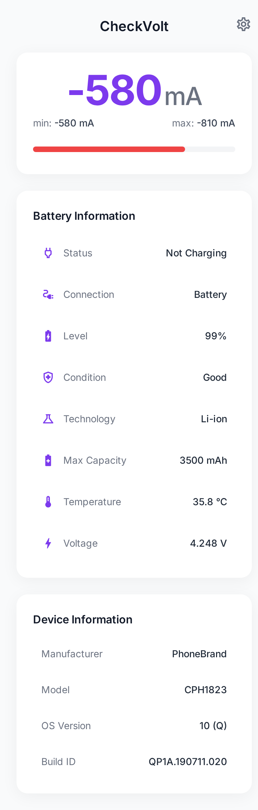
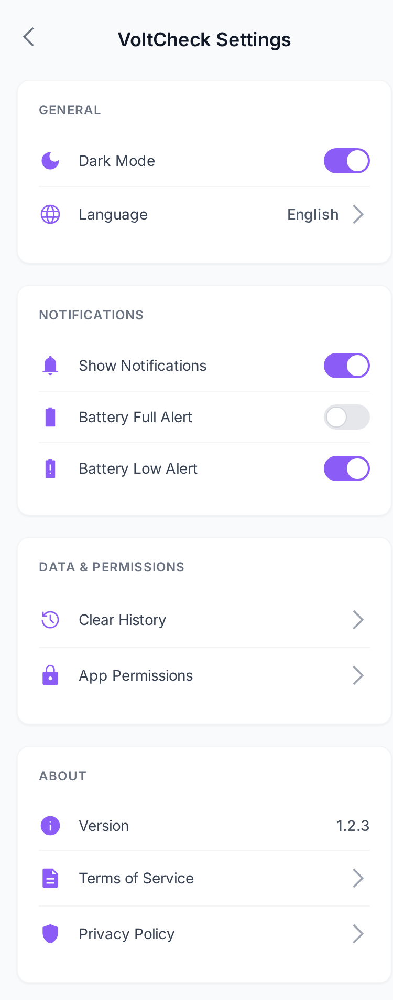
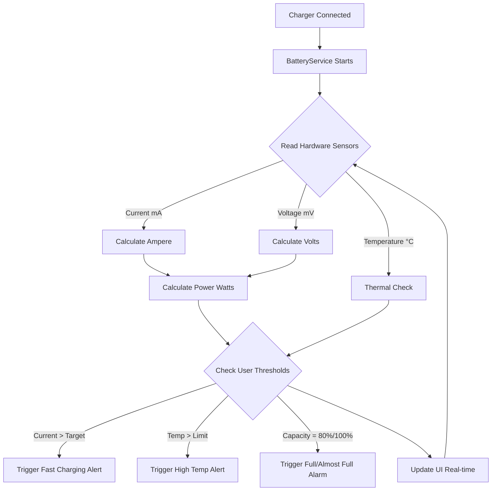

# VoltCheck

>  **A 100% Free & Open Source Project**

A comprehensive battery and electrical current monitoring application for Android devices.

[](https://github.com/davizofficial/VoltCheck)
[](https://developer.android.com)
[](https://www.java.com)
[](https://developer.android.com/about/versions/nougat)
[](LICENSE)


## Overview

**VoltCheck** is an advanced electrical measurement and battery diagnostic application designed for Android devices. Its primary function is to measure and display the real-time electrical current (Voltage and Ampere) actively flowing into your battery during charging. Beyond basic battery percentages, VoltCheck offers a deep dive into your device's power intake, battery health, and charging stability. Built with modern Material Design principles, the application provides an intuitive, professional, and reliable interface for anyone looking to evaluate their device's battery and charging performance.

## Screenshots

<div align="center">
  
  
</div>

<p align="center">
  <em>Main monitoring interface and Settings page</em>
</p>

## The Problem: Why VoltCheck?

In today's fast-paced world, smartphones are essential, and their charging efficiency is critical. However, users often face several hidden issues:
- **Counterfeit Accessories**: Fake chargers and damaged cables may claim to support "Fast Charging" but secretly deliver low, unstable currents that take hours to charge your device.
- **Battery Degradation**: Over time, extreme temperatures and poor charging habits silently destroy battery health.
- **Unstable Power Supplies**: Surges and drops in electrical current can damage the phone's internal charging IC.

Without specialized hardware, a normal user cannot see what is actually happening during a charge cycle.

## The Solution

**VoltCheck** solves this by turning your smartphone into a portable electrical multimeter. By tapping directly into Android's native Battery Manager API, it continuously reads the raw data from your device's power sensors. 
- You can instantly verify if a new charger or cable is delivering the promised speed (e.g., detecting if it outputs a healthy 2000mA or a weak 300mA).
- It alerts you if the battery temperature reaches dangerous levels.
- It provides audible alarms when the battery reaches optimal charge limits (like 80% or 100%) to prevent overcharging degradation.

## How It Works (Workflow)

The application operates as a foreground service that continuously polls sensor data, evaluates it against user-defined thresholds, and triggers UI updates or system notifications.



## Features

### Core Monitoring
- **Real-Time Electrical Measurement**: Track live incoming current (mA / Ampere) and Voltage (V) with high precision.
- **Thermal Monitoring**: Keep an eye on battery temperature to prevent overheating damage.
- **Battery Health Diagnostics**: View condition, technology (e.g., Li-ion), and raw design capacity.

### Smart Notification System
- **Almost Full Alert (80%)**: Protect battery lifespan by unplugging before maximum stress.
- **Full Charge Alarm**: Audible alarm when the battery hits 100%.
- **Fast Charging Detection**: Instant notification when high-speed charging is successfully established.
- **Slow Charging / Unstable Current Warnings**: Get warned immediately if your cable is faulty.
- **Overheating Alerts**: Safety notifications when the device becomes too hot.

### Advanced Capabilities & Customization
- **Background Service**: Uninterrupted monitoring even when the app is closed.
- **Custom Refresh Intervals**: Adjust polling rates (1s, 5s, 10s) to balance accuracy and power consumption.
- **Multi-language Support**: Fully localized in English and Indonesian.
- **Data Export**: Save and export historical charging sessions to CSV format for external analysis.

## Electrical Formulas Used

VoltCheck relies on standard electrical formulas to compute the data shown on your screen. Here is a quick reference:

- **Current (I)**: Measured in Amperes (A) or milliamperes (mA). 
  - `1 A = 1000 mA`
- **Voltage (V)**: The electrical pressure, measured in Volts (V).
- **Power (P)**: The total charging speed, measured in Watts (W).
  - `Power (W) = Voltage (V) × Current (A)`
  - *Example: If your device is receiving 4.2V at 2000mA (2A), the charging power is 8.4W.*

## System Requirements

- Android 7.0 (Nougat) or higher
- Device with accessible battery current measurement hardware
- Storage permission (for CSV data export)

## Installation

### Building from Source

1. Clone the repository:
```bash
git clone https://github.com/davizofficial/VoltCheck.git
cd VoltCheck
```
2. Open the project in Android Studio.
3. Build the project:
```bash
./gradlew assembleDebug
```

### From Release
Download the latest APK from the [Releases](https://github.com/davizofficial/VoltCheck/releases) page and install it on your Android device.

## Contributing

Contributions are welcome. You can contribute to VoltCheck by fixing bugs, improving documentation, adding new features, improving UI/UX, or suggesting ideas through Issues.

### How to Contribute

1. Fork this repository
2. Clone your forked repository
   ```git clone https://github.com/your-username/VoltCheck.git```
   ```cd VoltCheck```
3. Create a new branch
  ``` git checkout -b feature/your-feature-name ```
4. Make your changes
5. Build and test the project
   ``` ./gradlew assembleDebug ```
6. Commit your changes
``` git commit -m "feat: add your feature description" ```
7. Push your branch
``` git push origin feature/your-feature-name ```
8. Open a Pull Request to the main repository
   
### Pull Request Guidelines

Before submitting a Pull Request, please make sure:

- The project builds successfully
- The code follows the existing project style
- The change is clearly described
- Documentation is updated if needed
- Screenshots are included for UI changes

More information. See the [CONTRIBUTING.MD](CONTRIBUTING.MD)

## License

Copyright (c) 2026 davizofficial

This project is licensed under the MIT License. See the LICENSE file for details.

## Author

**davizofficial**
- GitHub: [davizofficial](https://github.com/davizofficial)
- Project Link: [https://github.com/davizofficial/VoltCheck](https://github.com/davizofficial/VoltCheck)

## Support

For questions, bug reports, or feature requests:
- **Issues**: [GitHub Issues](https://github.com/davizofficial/VoltCheck/issues)
- **Discussions**: [GitHub Discussions](https://github.com/davizofficial/VoltCheck/discussions)

---

**Note**: Battery current measurement accuracy depends entirely on your device's hardware capabilities and kernel implementation. Some custom ROMs or specific manufacturers may not expose raw current data accurately.

Copyright (c) 2026 davizofficial. Open source Project.
